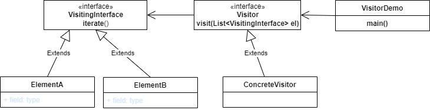

# Visitor Design Pattern

The Visitor pattern represents an operation to be performed on the elements of an object structure without changing the classes on which it operates.  

UML class diagram :

